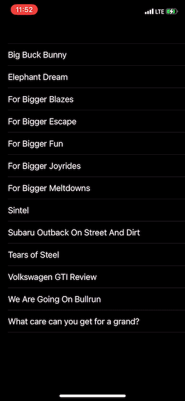

# PiPPlayer
Picture-In-Picture Extension

## Adopting Picture-in-Picture
- You need to set up AVAudioSessionCategoryPlayback.
- You need to add Background Modes section.

### Swift
- ViewController -> settingUpPiPController

### Objective-C
- ViewController -> settingUpPiPController

### demo

